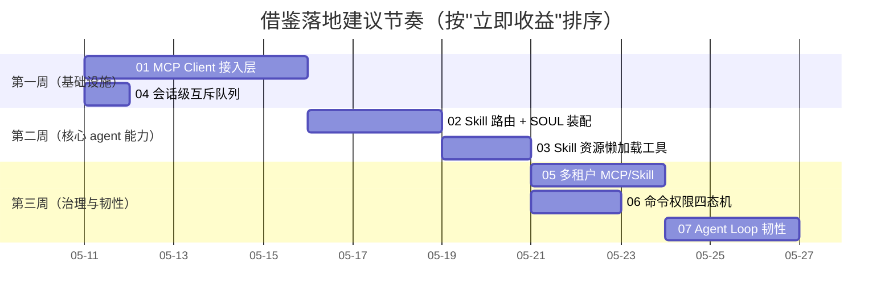

# 从 DataClaw 借鉴的设计思想

> 本目录是一份"可执行级"的迁移手册：每个专题都给出**为什么、是什么、怎么落地**，并指明在 `agent-platform` 的目标文件路径与 Python 代码骨架。开启新 Cursor/Claude session 时，直接把对应专题文档作为上下文即可启动实施。

## 0. 背景

`DataClaw`（`/Users/zhaichuancheng/DevelopSpace/dataclaw`）是一个 TypeScript + Express 实现的对话型 Agent，业务上做企业微信对接 + OpenAI 工具循环。它的"分层"是传统 `routes / services / stores` 扁平结构，**不建议照搬**；但其中沉淀的若干"agent 业务工程化"细节非常值钱，本文档系统性地整理为可在 `agent-platform`（Python + DDD/Clean）落地的迁移项。

DataClaw 与 agent-platform 的关键差异：

| 维度 | DataClaw | agent-platform |
|---|---|---|
| 语言/框架 | TypeScript + Express | Python 3.11+ + FastAPI/Click |
| 分层 | 功能型扁平 | DDD/Clean 四层（domain / application / infrastructure / interfaces） |
| 入口 | HTTP `/chat` + 企业微信 WS | HTTP `/v1/*` + CLI + scheduler + MCP stdio |
| 目标形态 | 单一对话 agent + 工具循环 | 多 agent 平台 + 评测/回测/演化 |

下面所有借鉴点的目标都是：**在不破坏 agent-platform 的分层与依赖方向的前提下，把 dataclaw 的工程化沉淀引入 agent-platform**。

---

## 1. 借鉴清单与优先级

按"实施 ROI"从高到低排序：

| # | 专题 | 文档 | ROI | 工作量 | 是否 agent-platform 缺失 |
|---|---|---|---|---|---|
| 1 | MCP Client 接入层（多 transport / 池化 / 多租户合并 / 脱敏） | [`01-mcp-client-layer.md`](./01-mcp-client-layer.md) | 极高 | 3-5 人日 | 完全缺失 |
| 2 | Skill 路由（关键词 + LLM intent + Top-K + 静默回落）+ SOUL 装配 | [`02-skill-routing-and-soul-composer.md`](./02-skill-routing-and-soul-composer.md) | 极高 | 2-3 人日 | 部分缺失（只有静态 manifest） |
| 3 | Skill 资源懒加载工具（`list_skill_files` / `load_skill_resource`） | [`03-skill-resources-lazy-load.md`](./03-skill-resources-lazy-load.md) | 高 | 1-2 人日 | 完全缺失 |
| 4 | 会话级互斥队列（防同会话并发踩踏） | [`04-session-queue.md`](./04-session-queue.md) | 高 | 0.5 人日 | 完全缺失 |
| 5 | 多租户：per-user MCP / per-user Skill | [`05-per-user-tenancy.md`](./05-per-user-tenancy.md) | 高 | 2-3 人日 | 完全缺失 |
| 6 | 命令权限四态机（safe / approved / needs_approval / denied） | [`06-command-permission.md`](./06-command-permission.md) | 中高 | 1-2 人日 | 部分（仅静态 yaml 规则） |
| 7 | Agent Loop 韧性（dangling tool call 修复 / 上下文压缩 / 启发式重试） | [`07-agent-loop-resilience.md`](./07-agent-loop-resilience.md) | 中高 | 2-3 人日 | 部分缺失 |

建议实施节奏：



---

## 2. 通用迁移原则

每个专题都遵守同一套规则，避免污染 agent-platform 的分层：

### 2.1 依赖方向

```
interfaces / cli / scheduler / mcp_stdio
        │
        ▼
   application/<usecase>
        │ depends on
        ▼
      domain (protocols + models)
        ▲ implements
        │
   infrastructure/<adapter>
```

- "**协议（Protocol）声明在 `domain/`**"，例如 `SkillRepository`、`McpClientPool`、`PermissionRepository`；
- "**实现挂在 `infrastructure/`**"，按外部依赖类型分子目录：`mcp/`、`skills/`、`permissions/` 等；
- "**编排逻辑在 `application/`**"，例如 `SkillRouter`、`SoulComposer`、`SessionLockRegistry`；
- "**入口适配器在 `interfaces/`**"，每个入口只做协议转换，不写业务。

### 2.2 配置约定

新增配置统一进 `agent_platform/config/settings.py` 的 `Settings`（pydantic-settings），并在 `.env.example` 增加示例。命名前缀：

| 模块 | 前缀 |
|---|---|
| MCP | `MCP_` |
| Skill | `SKILL_` |
| Permission | `PERMISSION_` |
| Session | `SESSION_` |

### 2.3 静默回退原则

dataclaw 在多个地方采用"**LLM 选 / DB 拿 / IO 任何失败都静默回退到关键词或默认值**"的策略，避免单点故障把整个 agent loop 带崩。我们沿用这个原则，但**必须 `logger.warning(..., exc_info=True)`**，不能像 dataclaw 那样彻底吞错。

### 2.4 可观测性

所有借鉴点都要在 `observability/` 里产生事件/指标：

- 关键决策（skill 选中、tool 调用、命令审批）打 trace span；
- 通过 `runtime_context` 透传 `trace_id / principal_id / session_id`；
- 失败路径必须 `logger.warning` + `metrics.counter("xxx_failed").inc()`。

### 2.5 测试约定

每个专题完成后：

- `tests/unit/<module>/` 至少 1 个 happy path + 2 个 edge case；
- `tests/integration/` 至少 1 个端到端用例（可 mock LLM/外部 IO）；
- `pytest -q` 必须全绿；
- 关键模块（路由/池/权限）的覆盖率 ≥ 85%。

---

## 3. 各专题文档导航

| 文档 | 你能读到什么 |
|---|---|
| [`01-mcp-client-layer.md`](./01-mcp-client-layer.md) | DataClaw 的 MCP 客户端架构拆解，Python 等价实现（含 `transport_factory` / `mcp_session_pool` / `mcp_registry`），与 `agent-platform` 现有 `infrastructure/mcp/` 的结合方式 |
| [`02-skill-routing-and-soul-composer.md`](./02-skill-routing-and-soul-composer.md) | 如何把"keyword + LLM intent + Top-K"路由器与"SOUL 装配 + routing 元信息"做成一等公民，注入到 `application/agent.py` 的 prompt 装配阶段 |
| [`03-skill-resources-lazy-load.md`](./03-skill-resources-lazy-load.md) | `references/scripts/assets/templates` 资源约定，以及配套的 `list_skill_files / load_skill_resource` 工具实现（Anthropic Skills 推荐范式） |
| [`04-session-queue.md`](./04-session-queue.md) | 一个 30 行 asyncio 实现的"per-key 串行队列"，防止 IM 重发/重试/HB 任务并发踩同一会话 |
| [`05-per-user-tenancy.md`](./05-per-user-tenancy.md) | per-user MCP / per-user Skill 模型与"系统 vs 用户"优先级合并，配套 admin API |
| [`06-command-permission.md`](./06-command-permission.md) | "白名单 / 危险正则 / 持久化批准 / 前缀通配"四态机，强化 `policy/guardrails` |
| [`07-agent-loop-resilience.md`](./07-agent-loop-resilience.md) | dangling tool call 修复、history trim 边界处理、上下文阈值压缩、启发式重试机制（避免"早停"） |

---

## 4. 给新 session 的 Prompt 模板

如果你想用新 Cursor/Claude session 直接执行某个专题，可以这样起手：

```
请阅读 /Users/zhaichuancheng/DevelopSpace/agent-platform/docs/borrowed-from-dataclaw/<XX>.md，
按其中"目标位置 / Python 骨架 / 迁移步骤"实施。
约束：
- 严格遵守 agent-platform 的 DDD 分层（domain / application / infrastructure / interfaces）；
- 新增协议放 domain/，实现放 infrastructure/，编排放 application/；
- 配置走 agent_platform/config/settings.py + .env.example；
- 静默回退路径必须 logger.warning(..., exc_info=True)，不能吞错；
- 完成后 pytest -q 全绿，关键模块覆盖率 ≥ 85%。
原始 dataclaw 源码在 /Users/zhaichuancheng/DevelopSpace/dataclaw/src，可作为对照参考但**不要照搬其分层**。
```

---

## 5. 不建议借鉴的点（避免被带偏）

- **30+ 文件平铺在 `services/`**：`agent-platform` 的 DDD 分层比这个干净得多，不要倒退；
- **`SkillsEngine` 1600+ 行单类**：把"发现 / CRUD / 路由 / 装配 / 资源加载 / 多后端"全揉在一起；我们要拆成 `SkillRepository / SkillRouter / SoulComposer / SkillResourceLoader` 四件；
- **`try { ... } catch { /* ignore */ }`**：dataclaw 多处静默吞错，连 log 都没有；我们必须 `logger.warning(..., exc_info=True)`；
- **prompt 字符串硬编码在 services 内**：agent-platform 已经有 `resources/prompts/` + `manifest.json`，不要倒退；
- **routes 与 wecomGateway 混在 `services`**：agent-platform 的 `interfaces/` 已经做了入口分组，沿用即可。
